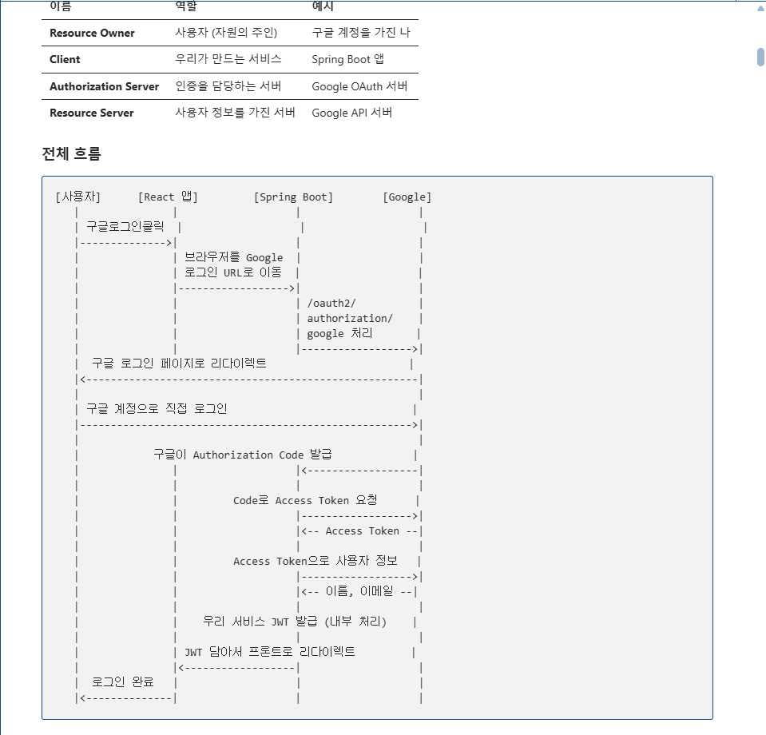
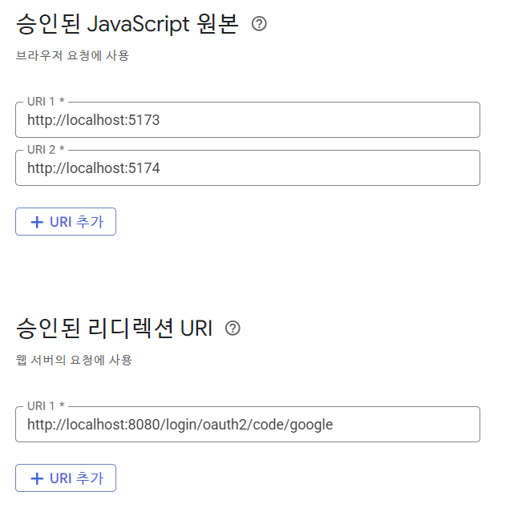

# 입실 체크!

# OAuth2 구현
1. OAuth2란?
  - Open Authorization 2.0의 축약어로 사용자의 비밀번호를 직접 받지 않고
    구글 / 카카오와 같은 외부 서비스를 통해 사용자를 인증 (Authentication)하는 표준 방법
  
  - GitHub 로그인할 때 구글 계정으로 로그인 버튼 눌렀을 때 일어나는 과정을 생각

  - 근데, 생각해보면 sign up(회원가입)할 때는 결국 username / email 쓰고 비밀번호 입력하기는 함.
    그렇다면 회원 정보가 웹 사이트의 DB에 이미 존재하기는 하는데 로그인은 구글로 한다고 볼 수 있음.

2. 왜 필요한가?
  - 기존 방식의 경우 사용자가 사이트에 username / password를 입력하게 되면
    서버가 구글에 대신 로그인을 해줌 -> 그러면 사용자 비밀번호가 서버에 노출되는 형태.

  - OAuth2 방식의 경우 구글 로그인 페이지에서 구글에 로그인을 시도하고
    -> 서버는 _허가 코드_ 를 받음.
    -> 그리고 이 허가 코드를 통해 사용자 정보를 받아오게 되기에
    : 구글만 구글 비밀 번호를 확인 가능



- 이상에서 중요한 점은,
  1. 사용자는 구글 페이지에서 직접 로그인
  2. 구글은 Authorization Code를 주고, 이를 통해 Access Token을 받게 됨.
  3. Access Token으로 구글 API에서 사용자 정보를 받아온 후에,
  4. 웹 사이트의 서버는 해당 사용자 정보와 일치하는 것은 발견한 후 웹 사이트의 JWT를 발급해서 프론트로 전달

## BackEnd 파트 작성
1. 어제 작성한 버전에서 default 검색이 되지 않는다는 점.
```java
implementation 'io.jsonwebtoken:jjwt-api:0.13.0'
runtimeOnly 'io.jsonwebtoken:jjwt-impl:0.13.0'
runtimeOnly 'io.jsonwebtoken:jjwt-jackson:0.13.0'
```

2. chrome에서 gcp 검색 -> google cloud platform 축약어 : gemini API key 발급받을 때
   프로젝트 하나 생성했었다고 수업함.

승인된 리드렉션 URI
`http://localhost:8080/login/oauth2/code/google`



```java
// MariaDB 설정
spring.datasource.url=jdbc:mariadb://localhost:3310/oauth2_demo
spring.datasource.username=root
spring.datasource.password=1234
spring.datasource.driver-class-name=org.mariadb.jdbc.Driver
// Hibernate - JPA 관련 설정
spring.jpa.hibernate.ddl-auto=update
spring.jpa.show-sql=true
spring.jpa.properties.hibernate.format_sql=true
spring.jpa.properties.hibernate.dialect=org.hibernate.dialect.MariaDBDialect
// GCP OAuth2 관련 설정
spring.security.oauth2.client.registration.google.client-id=YOUR_CLIENT_ID
spring.security.oauth2.client.registration.google.client-secret=YOUR_CLIENT_SECRET
spring.security.oauth2.client.registration.google.scope=email,profile
spring.security.oauth2.client.registration.google.redirect-uri=http://localhost:8080/login/oauth2/code/google

spring.security.oauth2.client.provider.google.authorization-uri=https://accounts.google.com/o/oauth2/v2/auth
spring.security.oauth2.client.provider.google.token-uri=https://oauth2.googleapis.com/token
spring.security.oauth2.client.provider.google.user-info-uri=https://www.googleapis.com/oauth2/v3/userinfo
// sub : 구글이 부여하는 사용자 고유 식별자
spring.security.oauth2.client.provider.google.user-name-attribute=sub

// JWT 관련 설정
// frontend에서의 .env처럼 환경변수를 저장할겁니다(car에서는 그렇게 안함)
jwt.secret=mySecretKeyForJwtTokenGenerationMustBe256BitsLong1234567890
jwt.expiration=86400000
```

3. application.properties 작성
- jwt 예시 : mySecretKeyForJwtTokenGenerationMustBe256BitsLong1234567890

4. Backend 상에서의 코드 작성
- 엔티티 - 레포지토리 - DTO - 서비스 - 시큐리티 - 컨피그 - 컨트롤러

- 루트 패키지 내부에 이하의 패키지를 생성
  1. config
  2. controller
  3. dto
  4. entity
  5. exception
  6. repository
  7. security
  8. service

5. 엔티티 작성
  - 주의 사항 : User / OAuth2User 엔티티를 별개로 나눔
  - 이유 : provider 를 application.properties에 정의했는데,
          poovider는 oauth2를 지원하는 '제공자'임.
          즉, google, naver, kakao, github 등이 있음.
          근데, User 객체 (혹은 테이블에서의 row)가 google, naver에 로그인 연동을 해놨다면
          provider field에 값이 여러 개가 될 것이고,
          아무 연동도 하지 않은 row의 경우에는 null 값이 들어가는 등 정리가 안될것

6. Repository 작성 : 근데 이건 템플릿이다. 저희는 JPA를 쓰니까.
  - 이후에 custom method들을 정의했습니다. 해당 이유에 대해서는 수업 시간에 설명함.
  - Optional 쓰는 이유 : nullPointerException 처리 안하게. -> 다만 .get() 하는 과정이 필요하다.
  - 복수의 특정 field를 사용하는 메서드 정의 이유 : 보안상.

7. DTO 정의할겁니다. 회원 가입할 때는 field들 다 채워야하는데 로그인할 때는 email / password로만 할거고, google 로그인 구현하면 그 와중에 비밀번호 null값인데 entity값이 다 일치하는 식으로 POST 요청을 보낼 필요가 없습니다. cardatabase에서 AccountCredential을 record로 정의했었습니다. -> 이번에는 class로 정의할 예정.

- DTO 작성 시에 필요 정보들 넣어서 보낼 수 있도록 springboot 상에서 지원하는 validation 의존성 추가하겠습니다.
- MVN에서 validation 검색 -> Spring Boot Starter Validation 선택
- build.gradle에 복사합니다 -> 불안해서 버전은 지우겠습니다.
`implementation 'org.springframework.boot:spring-boot-starter-validation`

